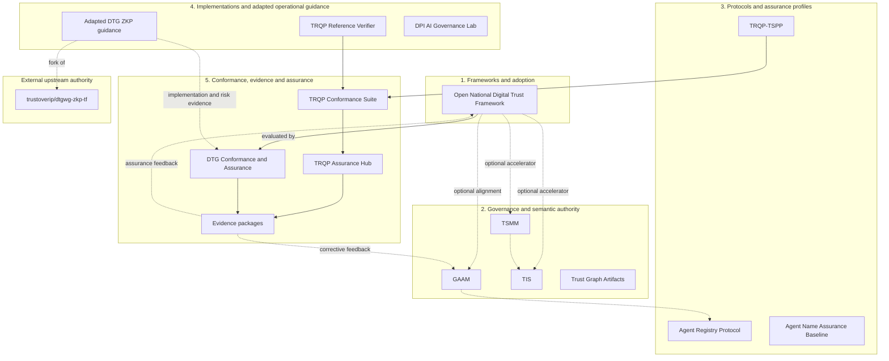

# Sankarshan Mukhopadhyay

## Building executable governance, authority-control planes, and assurance infrastructure

I design specifications, protocols, schemas, conformance systems, and reference implementations for digital trust and agentic systems. The work focuses on making authority, delegation, constraints, revocation, evidence, accountability, and redress explicit enough to be implemented, tested, audited, and independently challenged.

> **Core premise:** trust becomes infrastructure only when authority, constraints, revocation, evidence, and redress are operational, enforceable, and independently verifiable.

[](https://github.com/sankarshanmukhopadhyay/sankarshanmukhopadhyay/actions/workflows/validate.yml)
[](https://sankarshanmukhopadhyay.github.io/sankarshanmukhopadhyay/)
[](LICENSE)

## Portfolio Assurance Monitor

The repository includes a weekly, evidence-producing assurance monitor for flagship original repositories. It derives scope from the governed portfolio register, checks public operational evidence and repository-local status declarations, and publishes findings without automatically modifying portfolio classifications.

- [Monitor overview](docs/portfolio-assurance/index.md)
- [Methodology](docs/portfolio-assurance/methodology.md)
- [Operations](docs/portfolio-assurance/operations.md)
- [Dashboard](docs/portfolio-assurance/dashboard.md)

## Portfolio scope

This profile presents a **curated trust-infrastructure portfolio**. It is not an exhaustive inventory of every public repository on this GitHub account. Older infrastructure projects, personal utilities, conference material, upstream mirrors, and unrelated historical work may remain publicly accessible without being portfolio members.

Every repository reviewed by this programme receives an account-level disposition. Only included, adjacent, upstream-reference, and historical portfolio repositories receive detailed portfolio governance records.

## How status is communicated

Repository significance and readiness are separate claims.

| Dimension | Question answered |
|---|---|
| Portfolio disposition | Is the repository part of, adjacent to, or outside the curated portfolio? |
| Tier | How strategically prominent is it within the portfolio? |
| Maturity | How ready is its declared output for use? |
| Lifecycle | Is it active, maintained, superseded, or archived? |
| Operational status | What work is currently occurring? |
| Specification status | What formal status does its specification claim? |
| Provenance | Is it original, forked, mirrored, or collaboratively hosted? |
| Authority | What does the repository govern, and what remains elsewhere? |

The authoritative vocabulary and current classifications are maintained in [`data/repository-status.yaml`](data/repository-status.yaml). Featured original repositories are expected to publish a repository-local `PROJECT-STATUS.yaml` conforming to [`schemas/project-status.schema.json`](schemas/project-status.schema.json).

## Start here

| You are trying to… | Begin with | Current positioning |
|---|---|---|
| Design or assess a national or multi-sector digital trust framework | [Open National Digital Trust Framework](https://github.com/sankarshanmukhopadhyay/open-national-digital-trust-framework) | Flagship · Working draft · Original |
| Model authority, delegation, revocation, accountability, or remedy | [Governance, Authority and Assurance Metamodel](https://github.com/sankarshanmukhopadhyay/governance-authority-assurance-metamodel) | Flagship · Candidate · Original |
| Analyse the semantics of a trust system | [Trust Systems Meta Model](https://github.com/sankarshanmukhopadhyay/trust-systems-meta-model) | Flagship · Candidate · Original |
| Implement portable trust records or evidence contracts | [Trust Infrastructure Schemas](https://github.com/sankarshanmukhopadhyay/trust-infrastructure-schemas) | Flagship · Candidate · Original |
| Deploy or evaluate an agent registry | [Agent Registry Protocol](https://github.com/sankarshanmukhopadhyay/agent-registry-protocol) | Flagship · Pilot ready · Original |
| Test or assure a trust-registry deployment | [TRQP Assurance Hub](https://github.com/sankarshanmukhopadhyay/trqp-assurance-hub) | Flagship · Pilot ready · Original |
| Apply ZKP implementation, threat, risk, and deployment guidance | [DTG ZKP Task Force fork](https://github.com/sankarshanmukhopadhyay/dtgwg-zkp-tf) | Featured · Implementation draft · Adapted upstream work |
| Review governed digital-trust terminology | [CTWG Main Glossary fork](https://github.com/sankarshanmukhopadhyay/ctwg-main-glossary) | Upstream collaboration · Upstream tracking |
| Examine agent-transfer protocol implementation and hardening | [AGTP fork](https://github.com/sankarshanmukhopadhyay/agtp) | Upstream collaboration · Upstream tracking |

## Flagship original work

| Repository | Operational contribution | Maturity | Operational status |
|---|---|---|---|
| [Governance, Authority and Assurance Metamodel](https://github.com/sankarshanmukhopadhyay/governance-authority-assurance-metamodel) | Normative model for executable governance, delegation, revocation, assurance, accountability, appeal, and remedy | Candidate | Active validation |
| [Agent Registry Protocol](https://github.com/sankarshanmukhopadhyay/agent-registry-protocol) | Protocol, schemas, APIs, conformance tests, and reference artefacts for deployable agent registries | Pilot ready | Active validation |
| [Trust Systems Meta Model](https://github.com/sankarshanmukhopadhyay/trust-systems-meta-model) | Semantic metamodel for actors, authority, policy, evidence, decisions, effects, and accountability | Candidate | Active validation |
| [Trust Infrastructure Schemas](https://github.com/sankarshanmukhopadhyay/trust-infrastructure-schemas) | Portable machine-readable contracts for trust actors, claims, bindings, relationships, and evidence | Candidate | Active validation |
| [Trust Graph Artifacts](https://github.com/sankarshanmukhopadhyay/trust-graph-artifacts) | Applied governance patterns, threat models, implementation guidance, and negative-assurance artefacts | Candidate | Active validation |
| [TRQP-TSPP](https://github.com/sankarshanmukhopadhyay/TRQP-TSPP) | Security and trust-service-provider profile for TRQP | Candidate | Active validation |
| [TRQP reference verifier](https://github.com/sankarshanmukhopadhyay/cawg-trqp-verifier-refimpl) | Deterministic verifier producing provenance-preserving conclusions | Pilot ready | Active validation |
| [TRQP Conformance Suite](https://github.com/sankarshanmukhopadhyay/trqp-conformance-suite) | Executable tests producing lifecycle-aware interoperability evidence | Pilot ready | Active validation |
| [TRQP Assurance Hub](https://github.com/sankarshanmukhopadhyay/trqp-assurance-hub) | Coordinated implementation, conformance, evidence, and assurance entry point | Pilot ready | Active validation |

## Supporting and adjacent work

Supporting repositories provide domain profiles, reusable assurance methods, applied laboratories, implementation guidance, and research. Inclusion here does not imply the same strategic tier or adoption maturity as flagship work.

- [Agent Name Assurance Baseline](https://github.com/sankarshanmukhopadhyay/agent-name-assurance-baseline)
- [DTG Conformance and Assurance](https://github.com/sankarshanmukhopadhyay/dtg-conformance-assurance)
- [ERC-8004 CSP](https://github.com/sankarshanmukhopadhyay/ERC-8004-CSP)
- [KiranaOS](https://github.com/sankarshanmukhopadhyay/kiranaos)
- [Digital Governance Paper Notes](https://github.com/sankarshanmukhopadhyay/digital-governance-paper-notes)
- [DPI AI Governance Lab](https://github.com/sankarshanmukhopadhyay/dpi-ai-governance-lab)
- [DPI AI Governance Artifacts](https://github.com/sankarshanmukhopadhyay/dpi-ai-governance-artifacts)
- [ARF Onramp Pack](https://github.com/sankarshanmukhopadhyay/arf-onramp-pack)
- [Atal Enterprise Assurance Profile](https://github.com/sankarshanmukhopadhyay/atal-enterprise-assurance-profile)

## Adapted and reference upstream work

Fork inclusion represents bounded fork-local implementation, assurance, documentation, validation, or contribution-oriented work. `adapted-upstream-work` identifies a substantive portfolio-local capability, while `upstream-reference` identifies primarily tracking or collaboration use. Neither disposition implies upstream authorship, governance authority, release authority, endorsement, or adoption.

| Portfolio fork | Canonical upstream | Portfolio-local role |
|---|---|---|
| [DTG ZKP Task Force](https://github.com/sankarshanmukhopadhyay/dtgwg-zkp-tf) | `trustoverip/dtgwg-zkp-tf` | Adapted implementation, threat, risk, deployment, and learning guidance |
| [CTWG Main Glossary](https://github.com/sankarshanmukhopadhyay/ctwg-main-glossary) | `trustoverip/ctwg-main-glossary` | Terminology harmonisation and publication refinement |
| [AGTP](https://github.com/sankarshanmukhopadhyay/agtp) | `nomoticai/agtp` | Security hardening and implementation refinement |
| [DTG Credential Task Force](https://github.com/sankarshanmukhopadhyay/dtgwg-cred-tf) | `trustoverip/dtgwg-cred-tf` | Standards-facing collaboration |
| [Trust Registry Protocol](https://github.com/sankarshanmukhopadhyay/tswg-trust-registry-protocol) | `trustoverip/tswg-trust-registry-protocol` | Protocol reference and contribution surface |

## Portfolio architecture



Solid edges represent operational, implementation, testing, or evidence flows. Dashed edges represent informative alignment or contribution-oriented learning. The external-upstream boundary preserves authority and provenance while allowing fork-local adaptations to participate in the relevant implementation and assurance flows.

See [Portfolio Architecture](portfolio/architecture.md), [Portfolio Status](docs/portfolio-status.md), and the [Classification Policy](docs/portfolio-classification-policy.md).

## Governance and evidence

The profile repository owns portfolio membership, strategic tier, presentation, and relationship metadata. Each original member repository retains authority over its normative content, releases, maturity declaration, validation commands, and evidence outputs. The portfolio may record a finding or reduce public prominence when a member claim lacks sufficient evidence; it does not silently rewrite the member repository’s declaration.

Validation:

```bash
python scripts/validate_portfolio.py
python scripts/check_internal_links.py
```

## Writing and research

Long-form analysis is published through [The Trust Graph](https://thetrustgraph.substack.com/), focused on executable trust, registries, governance, agentic systems, digital public infrastructure, assurance, and redress.

## Licence

Unless a repository states otherwise, profile documentation is licensed under [CC BY-NC-SA 4.0](LICENSE). Individual repositories retain their own licences and governance terms.
