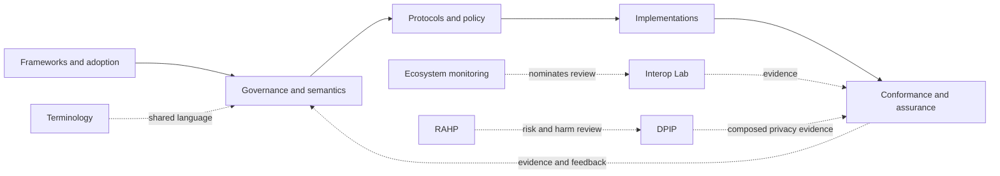

# Sankarshan Mukhopadhyay

## Building executable governance, authority-control planes, and assurance infrastructure

I design specifications, protocols, schemas, conformance systems, and reference implementations for digital trust and agentic systems. The work focuses on making authority, delegation, constraints, revocation, evidence, accountability, and redress explicit enough to be implemented, tested, audited, and independently challenged.

> **Core premise:** trust becomes infrastructure only when authority, constraints, revocation, evidence, and redress are operational, enforceable, and independently verifiable.

## Explore the work

**[Trust frameworks](https://github.com/qbf-consulting/open-national-digital-trust-framework)** · **[Governance and authority](https://github.com/qbf-consulting/governance-authority-assurance-metamodel)** · **[Agent infrastructure](https://github.com/qbf-consulting/agent-registry-protocol)** · **[Policy execution](https://github.com/sankarshanmukhopadhyay/PolicyMesh)** · **[Assurance and RAHP](https://github.com/sankarshanmukhopadhyay/rahp-toolkit)** · **[Composed privacy assurance](https://github.com/sankarshanmukhopadhyay/dtg-privacy-implementation-profile)** · **[Terminology](https://github.com/sankarshanmukhopadhyay/trust-infrastructure-glossary)** · **[Work queue](docs/portfolio-work/index.md)** · **[Portfolio dashboard](docs/portfolio-assurance/dashboard.md)**

This profile presents a **curated body-of-work portfolio**, not an ownership inventory. Projects remain part of the portfolio when institutional stewardship moves to an organisation such as [QBF Consulting](https://github.com/qbf-consulting). Repository ownership identifies current stewardship; portfolio inclusion records authorship, provenance, relationships and strategic context. Authority over normative content remains repository-local.

## Start here

| If you are trying to… | Start with |
|---|---|
| Design or assess a national or multi-sector digital trust framework | [Open National Digital Trust Framework](https://github.com/qbf-consulting/open-national-digital-trust-framework) |
| Model authority, delegation, revocation, accountability, appeal, or remedy | [Governance, Authority and Assurance Metamodel](https://github.com/qbf-consulting/governance-authority-assurance-metamodel) |
| Analyse the semantics of a trust system | [Trust Systems Meta Model](https://github.com/qbf-consulting/trust-systems-meta-model) |
| Implement portable trust records or evidence contracts | [Trust Infrastructure Schemas](https://github.com/qbf-consulting/trust-infrastructure-schemas) |
| Follow the Trust Systems Modelling Stack from semantics through portable contracts to executable governance | [TSMM](https://github.com/qbf-consulting/trust-systems-meta-model) → [TIS](https://github.com/qbf-consulting/trust-infrastructure-schemas) → [Trust Graph Artifacts](https://github.com/sankarshanmukhopadhyay/trust-graph-artifacts) |
| Deploy or evaluate an agent registry | [Agent Registry Protocol](https://github.com/qbf-consulting/agent-registry-protocol) |
| Determine whether an actor is permitted to act under mandate, evidence, policy, and time | [PolicyMesh](https://github.com/sankarshanmukhopadhyay/PolicyMesh) |
| Pressure-test a specification for harms, security weaknesses, and governance failure modes | [RAHP Toolkit](https://github.com/sankarshanmukhopadhyay/rahp-toolkit) |
| Evaluate whether a composed DTG interaction preserves an asserted privacy property | [DTG Privacy Implementation Profile](https://github.com/sankarshanmukhopadhyay/dtg-privacy-implementation-profile) |
| Implement, conform, or assure a TRQP trust-registry deployment | [TRQP-TSPP](https://github.com/sankarshanmukhopadhyay/TRQP-TSPP) → [reference verifier](https://github.com/sankarshanmukhopadhyay/cawg-trqp-verifier-refimpl) → [conformance suite](https://github.com/sankarshanmukhopadhyay/trqp-conformance-suite) → [assurance hub](https://github.com/sankarshanmukhopadhyay/trqp-assurance-hub) |

## Selected work

| Area | Project | Steward | Role in the portfolio |
|---|---|---|---|
| Trust frameworks | [Open National Digital Trust Framework](https://github.com/qbf-consulting/open-national-digital-trust-framework) | QBF Consulting | Reusable framework for national and multi-sector trust infrastructure |
| Governance | [Governance, Authority and Assurance Metamodel](https://github.com/qbf-consulting/governance-authority-assurance-metamodel) | QBF Consulting | Machine-oriented model for authority, delegation, revocation, assurance, accountability, appeal, and remedy |
| Agent infrastructure | [Agent Registry Protocol](https://github.com/qbf-consulting/agent-registry-protocol) | QBF Consulting | Protocol, schemas, APIs, conformance tests, and reference artefacts for deployable agent registries |
| Policy execution | [PolicyMesh](https://github.com/sankarshanmukhopadhyay/PolicyMesh) | Sankarshan | Bounded evaluation of policy, mandate, evidence, scope, and time |
| Assurance | [RAHP Toolkit](https://github.com/sankarshanmukhopadhyay/rahp-toolkit) | Sankarshan | Portable risk, harms, security, and specification-assurance infrastructure |
| Privacy assurance | [DTG Privacy Implementation Profile](https://github.com/sankarshanmukhopadhyay/dtg-privacy-implementation-profile) | Sankarshan | Executable evaluation of privacy claims over composed DTG interactions |
| Interoperability | [Trust Protocol Interop Lab](https://github.com/sankarshanmukhopadhyay/trust-protocol-interop-lab) | Sankarshan | Composition and seam testing across independently governed protocols |
| Ecosystem observation | [Trust Ecosystem Monitor](https://github.com/sankarshanmukhopadhyay/trust-ecosystem-monitor) | Sankarshan | Reusable observation and evidence infrastructure for standards and trust ecosystems |
| Terminology | [Trust Infrastructure Glossary](https://github.com/sankarshanmukhopadhyay/trust-infrastructure-glossary) | Sankarshan | Independently governed, plain-language terminology for trust infrastructure |

For the complete governed catalogue, maturity, lifecycle and stewardship state, see **[Portfolio Status](docs/portfolio-status.md)** and **[`data/repository-status.yaml`](data/repository-status.yaml)**.

## How the portfolio fits together

The portfolio treats trust infrastructure as separable but composable layers. Authority remains bounded: semantic models do not acquire protocol authority, interoperability experiments do not create adoption claims, monitoring does not create ecosystem authority, and assurance findings do not modify normative content automatically.

The **Trust Systems Modelling Stack (TSMS)** intentionally spans stewardship boundaries: [TSMM](https://github.com/qbf-consulting/trust-systems-meta-model) (QBF) owns canonical semantics, [TIS](https://github.com/qbf-consulting/trust-infrastructure-schemas) (QBF) owns portable contracts, and [Trust Graph Artifacts](https://github.com/sankarshanmukhopadhyay/trust-graph-artifacts) (Sankarshan) owns executable governance patterns, implementation guidance and negative assurance tests derived in part from the Trust Graph publishing programme. Composition does not transfer authority, copyright or stewardship between layers.

The TSMS adopter documentation is published from the QBF-maintained TSMM repository at [qbf-consulting.github.io/trust-systems-meta-model/](https://qbf-consulting.github.io/trust-systems-meta-model/).

See **[Portfolio Architecture](portfolio/architecture.md)** for the full system view.

## Portfolio assurance

This repository runs an evidence-producing portfolio assurance monitor over governed repositories, including projects stewarded outside this personal GitHub account. A finding is evidence for review, not an instruction; disposition, remediation and closure remain with the repository or authority that owns the affected scope.

- **[Assurance dashboard](docs/portfolio-assurance/dashboard.md)**
- **[Development finding feeds](docs/portfolio-assurance/findings.md)**
- **[Methodology](docs/portfolio-assurance/methodology.md)**
- **[Operations](docs/portfolio-assurance/operations.md)**

## Governance and provenance

The profile repository owns **portfolio membership, strategic presentation, relationship metadata, stewardship metadata and portfolio-level assurance evidence**. Individual repositories retain authority over normative content, releases, maturity declarations, validation commands and project-local evidence. A repository may therefore be a portfolio member without being owned by the `sankarshanmukhopadhyay` GitHub account.

Forks and adapted upstream work are identified explicitly. Inclusion in this portfolio does not imply upstream authorship, governance authority, release authority, endorsement or adoption.

## Working with this portfolio

- **Browse the portfolio:** [GitHub Pages](https://sankarshanmukhopadhyay.github.io/sankarshanmukhopadhyay/)
- **Choose the next bounded work item:** [Portfolio Work Queue](docs/portfolio-work/index.md)
- **Understand portfolio status:** [Portfolio Status](docs/portfolio-status.md)
- **Understand the architecture:** [Portfolio Architecture](portfolio/architecture.md)
- **Review assurance evidence:** [Portfolio Assurance](docs/portfolio-assurance/index.md)
- **Review governance:** [GOVERNANCE.md](GOVERNANCE.md)
- **Contribute:** [CONTRIBUTING.md](CONTRIBUTING.md)
- **Report security issues:** [SECURITY.md](SECURITY.md)
- **Review licensing:** [LICENSES.md](LICENSES.md)

Portfolio validation and link checks are automated. The profile README is intentionally a **front door**, not the portfolio database.