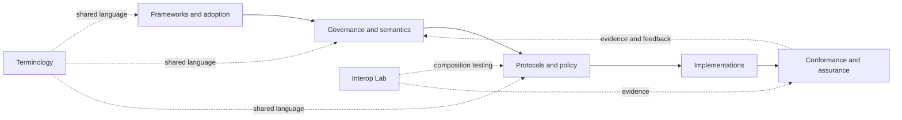

# Sankarshan Mukhopadhyay

## Building executable governance, authority-control planes, and assurance infrastructure

I design specifications, protocols, schemas, conformance systems, and reference implementations for digital trust and agentic systems. The work focuses on making authority, delegation, constraints, revocation, evidence, accountability, and redress explicit enough to be implemented, tested, audited, and independently challenged.

> **Core premise:** trust becomes infrastructure only when authority, constraints, revocation, evidence, and redress are operational, enforceable, and independently verifiable.

[](https://github.com/sankarshanmukhopadhyay/sankarshanmukhopadhyay/actions/workflows/validate.yml)
[](https://sankarshanmukhopadhyay.github.io/sankarshanmukhopadhyay/)
[](LICENSE-CODE)
[](LICENSE-CONTENT)

## Explore the work

**[Trust frameworks](https://github.com/sankarshanmukhopadhyay/open-national-digital-trust-framework)** · **[Governance and authority](https://github.com/sankarshanmukhopadhyay/governance-authority-assurance-metamodel)** · **[Agent infrastructure](https://github.com/sankarshanmukhopadhyay/agent-registry-protocol)** · **[Policy execution](https://github.com/sankarshanmukhopadhyay/PolicyMesh)** · **[Assurance and RAHP](https://github.com/sankarshanmukhopadhyay/rahp-toolkit)** · **[Terminology](https://github.com/sankarshanmukhopadhyay/trust-infrastructure-glossary)** · **[Portfolio dashboard](docs/portfolio-assurance/dashboard.md)**

This profile presents a **curated trust-infrastructure portfolio**, not an exhaustive inventory of every public repository on this GitHub account. Portfolio membership, maturity, lifecycle, provenance, and authority are governed explicitly rather than inferred from repository activity.

## Start here

| If you are trying to… | Start with |
|---|---|
| Design or assess a national or multi-sector digital trust framework | [Open National Digital Trust Framework](https://github.com/sankarshanmukhopadhyay/open-national-digital-trust-framework) |
| Model authority, delegation, revocation, accountability, appeal, or remedy | [Governance, Authority and Assurance Metamodel](https://github.com/sankarshanmukhopadhyay/governance-authority-assurance-metamodel) |
| Analyse the semantics of a trust system | [Trust Systems Meta Model](https://github.com/sankarshanmukhopadhyay/trust-systems-meta-model) |
| Implement portable trust records or evidence contracts | [Trust Infrastructure Schemas](https://github.com/sankarshanmukhopadhyay/trust-infrastructure-schemas) |
| Deploy or evaluate an agent registry | [Agent Registry Protocol](https://github.com/sankarshanmukhopadhyay/agent-registry-protocol) |
| Determine whether an actor is permitted to act under mandate, evidence, policy, and time | [PolicyMesh](https://github.com/sankarshanmukhopadhyay/PolicyMesh) |
| Pressure-test a specification for harms, security weaknesses, and governance failure modes | [RAHP Toolkit](https://github.com/sankarshanmukhopadhyay/rahp-toolkit) |
| Test or assure a trust-registry deployment | [TRQP Assurance Hub](https://github.com/sankarshanmukhopadhyay/trqp-assurance-hub) |

## Selected work

These repositories are representative entry points into the portfolio rather than a complete catalogue.

| Area | Project | Role in the portfolio |
|---|---|---|
| Trust frameworks | [Open National Digital Trust Framework](https://github.com/sankarshanmukhopadhyay/open-national-digital-trust-framework) | Reusable framework for national and multi-sector trust infrastructure |
| Governance | [Governance, Authority and Assurance Metamodel](https://github.com/sankarshanmukhopadhyay/governance-authority-assurance-metamodel) | Machine-oriented model for authority, delegation, revocation, assurance, accountability, appeal, and remedy |
| Agent infrastructure | [Agent Registry Protocol](https://github.com/sankarshanmukhopadhyay/agent-registry-protocol) | Protocol, schemas, APIs, conformance tests, and reference artefacts for deployable agent registries |
| Policy execution | [PolicyMesh](https://github.com/sankarshanmukhopadhyay/PolicyMesh) | Bounded evaluation of policy, mandate, evidence, scope, and time |
| Assurance | [RAHP Toolkit](https://github.com/sankarshanmukhopadhyay/rahp-toolkit) | Portable risk, harms, security, and specification-assurance infrastructure |
| Interoperability | [Trust Protocol Interop Lab](https://github.com/sankarshanmukhopadhyay/trust-protocol-interop-lab) | Composition and seam testing across independently governed protocols |
| Terminology | [Trust Infrastructure Glossary](https://github.com/sankarshanmukhopadhyay/trust-infrastructure-glossary) | Independently governed, plain-language terminology for trust infrastructure |

For the complete governed catalogue, maturity and lifecycle state, see **[Portfolio Status](docs/portfolio-status.md)**. For adapted, upstream-reference, adjacent, historical, and superseded work, see the **[Classification Policy](docs/portfolio-classification-policy.md)** and the machine-readable **[`data/repository-status.yaml`](data/repository-status.yaml)**.

## How the portfolio fits together

The portfolio treats trust infrastructure as a set of separable but composable layers. Authority remains bounded: semantic models do not acquire protocol authority, interoperability experiments do not create adoption claims, and assurance findings do not modify normative content automatically.



See **[Portfolio Architecture](portfolio/architecture.md)** for the full system view, authority boundaries, relationship semantics, and cross-repository dependencies.

## Portfolio assurance

This repository runs an evidence-producing portfolio assurance monitor over governed repositories. It checks declared project state against observable repository evidence, detects portfolio churn, retains historical observations, and publishes findings without silently changing repository-local declarations or portfolio classifications.

- **[Assurance dashboard](docs/portfolio-assurance/dashboard.md)** — current portfolio assurance view
- **[Development finding feeds](docs/portfolio-assurance/findings.md)** — per-repository downloadable JSON and Markdown findings that can be carried into release work
- **[Methodology](docs/portfolio-assurance/methodology.md)** — what is tested and how findings are derived
- **[Operations](docs/portfolio-assurance/operations.md)** — monitoring, evidence retention, issue routing, and recovery behaviour

A finding is evidence for review, not an instruction. Disposition, remediation, and closure remain with the repository or authority that owns the affected scope.

## Governance and provenance

The profile repository owns **portfolio membership, strategic presentation, relationship metadata, and portfolio-level assurance evidence**. Individual repositories retain authority over their normative content, releases, maturity declarations, validation commands, and project-local evidence.

Status is represented across distinct dimensions including portfolio disposition, maturity, lifecycle, operational status, specification status, provenance, and authority. The authoritative vocabulary and current classifications live in **[`data/repository-status.yaml`](data/repository-status.yaml)**; featured original repositories are expected to publish repository-local `PROJECT-STATUS.yaml` files conforming to **[`schemas/project-status.schema.json`](schemas/project-status.schema.json)**.

Forks and adapted upstream work are identified explicitly. Inclusion in this portfolio does not imply upstream authorship, governance authority, release authority, endorsement, or adoption.

## Working with this portfolio

- **Browse the portfolio:** [GitHub Pages](https://sankarshanmukhopadhyay.github.io/sankarshanmukhopadhyay/)
- **Understand portfolio status:** [Portfolio Status](docs/portfolio-status.md)
- **Understand the architecture:** [Portfolio Architecture](portfolio/architecture.md)
- **Review assurance evidence:** [Portfolio Assurance](docs/portfolio-assurance/index.md)
- **Review governance:** [GOVERNANCE.md](GOVERNANCE.md)
- **Contribute:** [CONTRIBUTING.md](CONTRIBUTING.md)
- **Report security issues:** [SECURITY.md](SECURITY.md)
- **Review licensing:** [LICENSES.md](LICENSES.md)

Portfolio validation and link checks are automated. Local validation can be run with:

```bash
python scripts/validate_portfolio.py
python scripts/check_internal_links.py
python scripts/check_site_navigation.py
```

The profile README is intentionally a **front door**, not the portfolio database. Detailed classifications, methodology, evidence, and historical state are maintained in the linked documentation and machine-readable artefacts.
