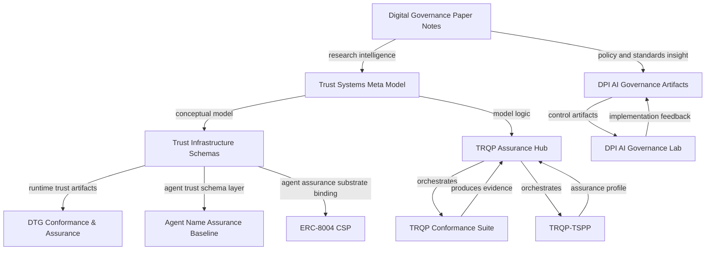

# Portfolio Architecture

This document describes the relationship model across the public repositories in this GitHub portfolio.

It is intended to make the portfolio easier to understand, maintain, extend, and audit as a coherent trust infrastructure ecosystem. The profile README remains the adoption entry point. This document acts as the architectural map.

## Purpose

The purpose of this document is to track meaningful inter-relationships among repositories without requiring every relationship to be explained directly in the profile README.

This document should be used for:

- contributor onboarding;
- cross-repo release planning;
- drift review;
- standards alignment;
- documentation refresh;
- future graph and matrix generation.

The goal is to move from a portfolio that is understandable by narrative inspection to a portfolio that is increasingly understandable through explicit, reviewable, and machine-readable relationships. The current machine-readable relationship source is [`data/portfolio-relationships.yaml`](../data/portfolio-relationships.yaml).

## Packaging principle

The portfolio should be packaged using a two-layer documentation model:

| Location | Function | Maintenance posture |
|---|---|---|
| `README.md` | Public adoption entry point | Keep concise, stable, and navigable |
| `docs/portfolio-architecture.md` | Detailed relationship and drift model | Update as repositories, bindings, profiles, and assurance paths evolve |

The README should explain what the portfolio is and where readers should start. This document should explain how the repositories relate to each other and what should be reviewed when one part of the portfolio changes.

## Relationship model

Repository relationships are classified using the following relationship types.

| Relationship | Meaning | Evidence expected |
|---|---|---|
| `informs` | Provides conceptual vocabulary, model structure, or design logic | README/docs references, shared terms, model diagrams, binding notes |
| `depends_on` | Requires another repository’s artifacts, schemas, examples, or outputs | Schema imports, example references, workflow dependencies, explicit compatibility notes |
| `profiles` | Defines an assurance, governance, security, or implementation profile for another layer | Profile docs, control mappings, assurance-level mappings |
| `validates` | Provides tests, checks, conformance logic, or verification workflows | Test fixtures, CI workflows, validation scripts, verdict outputs |
| `produces_evidence_for` | Generates outputs that another repository or assurance process can consume | Evidence bundles, decision receipts, conformance declarations, signed reports |
| `extends` | Adds a domain-specific layer to a more general model | Extension docs, domain profiles, mapping matrices |
| `binds_to` | Connects a portfolio concept to an external standard, ecosystem, or protocol | Binding docs, standards crosswalks, compatibility profiles |
| `references` | Cites or points to another repository without operational dependency | README links, related-work sections, citations |
| `drift_sensitive_to` | Should be reviewed when another repository changes | Drift watchlist entries, compatibility matrix rules, release checklist references |

A relationship should be treated as operational only when there is an artifact-level connection such as a schema, example, conformance output, workflow, compatibility matrix, or evidence bundle. Similar language alone should be treated as a weak thematic relationship until stronger evidence exists.

## Portfolio layers

```text
Conceptual Foundation
└── Trust Systems Meta Model

Schema and Trust Artifact Layer
└── Trust Infrastructure Schemas

Trust Registry Assurance Stack
├── TRQP Assurance Hub
├── TRQP Conformance Suite
└── TRQP-TSPP

Assurance and Conformance Evaluation
└── DTG Conformance & Assurance

Agent Identity and Delegated-Action Assurance
├── Agent Name Assurance Baseline
└── ERC-8004 CSP

Operational AI Governance
├── DPI AI Governance Artifacts
└── DPI AI Governance Lab

Research and Governance Intelligence
└── Digital Governance Paper Notes
```

## Key architectural conclusions

### 1. The portfolio is federated, not monolithic

The repositories should remain independently usable. Their relationship should be expressed through documentation, schemas, profiles, examples, and evidence artifacts rather than forced into a single monorepo.

This preserves adoption flexibility while still allowing the portfolio to be understood as a coherent trust infrastructure stack.

### 2. TSMM acts as the conceptual model layer

The Trust Systems Meta Model provides the abstract vocabulary for recurring concepts across the portfolio: entities, authority, delegation, claims, evidence, verification, policy-governed decisions, lifecycle state, and downstream effects.

It should be treated as a conceptual upstream for repositories that need shared language or modeling discipline.

### 3. Trust Infrastructure Schemas acts as the schema and control-plane artifact layer

Trust Infrastructure Schemas provides machine-readable structure for trust actors, claims, bindings, runtime trust artifacts, and recurring assurance relationships.

Repositories that consume or express runtime trust artifacts should track drift against this layer.

### 4. TRQP Hub, CTS, and TSPP form the trust registry assurance stack

These repositories should be treated as a coordinated but non-monorepo assurance stack:

- TRQP Assurance Hub: adoption, onboarding, compatibility, and assurance workflow entry point;
- TRQP Conformance Suite: executable conformance testing and verdict generation;
- TRQP-TSPP: trust service provider profile, assurance posture, and security/privacy controls.

The relationship among these repositories is operational rather than merely thematic because the stack is designed around conformance outputs, assurance profiles, compatibility expectations, and adoption workflows.

### 5. DCAS and ANAB are drift-sensitive to schema and runtime trust artifact changes

DCAS and ANAB should be reviewed when Trust Infrastructure Schemas introduces new or changed runtime trust artifact profiles, schema terms, evidence expectations, or assurance declarations.

This is especially important where agent identity, naming, authority, assurance, or runtime verification concepts evolve.

### 6. DPI AI Governance Artifacts and DPI AI Governance Lab form an implementation pair

The artifacts repository should be treated as the control and template layer. The lab repository should be treated as the implementation, demonstration, and experimentation layer.

Changes in one should be reviewed for documentation and artifact consistency in the other.

### 7. Digital Governance Paper Notes operates as research intelligence

Digital Governance Paper Notes should be treated as a research and policy intelligence layer that informs conceptual refinement across the portfolio.

It does not need to be operationally coupled to the implementation repositories, but its reviews can identify new policy tensions, assurance requirements, standards references, and governance patterns that should be evaluated for future incorporation.

## Relationship matrix

| Source repo | Target repo | Relationship | Rationale | Drift posture |
|---|---|---|---|---|
| `trust-systems-meta-model` | `trust-infrastructure-schemas` | `informs` | TSMM provides conceptual vocabulary and model structure for trust system artifacts | Review TIS terminology when TSMM concepts change |
| `trust-systems-meta-model` | `trqp-assurance-hub` | `informs` | TSMM provides the abstract model logic behind entities, authority, claims, evidence, and verification | Review Hub conceptual language when TSMM model structure changes |
| `trust-infrastructure-schemas` | `dtg-conformance-assurance` | `informs` / `drift_sensitive_to` | DCAS should track changes to runtime trust artifact and assurance schema expectations | Review DCAS profiles and examples when TIS releases new runtime artifacts |
| `trust-infrastructure-schemas` | `agent-name-assurance-baseline` | `informs` / `drift_sensitive_to` | ANAB should track changes to agent naming, identity, assurance, and runtime trust artifact concepts | Review ANAB controls when TIS updates agent, authority, or assurance schemas |
| `trust-infrastructure-schemas` | `ERC-8004-CSP` | `informs` / `binds_to` | ERC-8004 CSP extends agent assurance logic into an Ethereum-facing registration and verification environment | Review substrate-specific binding language when TIS changes agent trust artifacts |
| `trqp-assurance-hub` | `trqp-conformance-suite` | `orchestrates` / `consumes_evidence_from` | Hub references conformance outputs and adoption workflows from CTS | Review Hub compatibility and onboarding docs when CTS evidence outputs change |
| `trqp-assurance-hub` | `TRQP-TSPP` | `orchestrates` / `consumes_profile_from` | Hub references assurance posture and trust service provider profile expectations from TSPP | Review Hub assurance workflow docs when TSPP controls or assurance levels change |
| `trqp-conformance-suite` | `trqp-assurance-hub` | `produces_evidence_for` | CTS generates conformance results and evidence outputs useful to Hub workflows | Review Hub evidence references when CTS changes verdict or bundle structures |
| `TRQP-TSPP` | `trqp-assurance-hub` | `profiles` | TSPP contributes assurance profile and security/privacy posture expectations | Review Hub profile references when TSPP releases new controls or levels |
| `dpi-ai-governance-artifacts` | `dpi-ai-governance-lab` | `informs` | Artifacts provide controls, templates, and governance structures for implementation | Review lab examples when artifact controls or templates change |
| `dpi-ai-governance-lab` | `dpi-ai-governance-artifacts` | `validates` / `demonstrates` | Lab can demonstrate and test practical use of the governance artifacts | Feed implementation findings back into artifacts |
| `digital-governance-paper-notes` | portfolio | `informs` | Research reviews provide conceptual and policy intelligence that can influence portfolio evolution | Periodically review research findings for new control, assurance, and standards implications |

## Drift monitoring

The following changes should trigger cross-repo review.

| Change source | Review targets | Reason | Suggested evidence |
|---|---|---|---|
| TSMM terminology or model changes | TIS, DCAS, ANAB, TRQP Hub | Conceptual vocabulary drift | Updated glossary references, mapping notes, release checklist entry |
| TIS schema or runtime artifact changes | DCAS, ANAB, ERC-8004 CSP | Schema and runtime artifact drift | Schema diff, updated examples, compatibility note |
| CTS evidence bundle or verdict changes | TRQP Hub, TRQP-TSPP | Assurance workflow drift | Evidence bundle example, workflow update, compatibility matrix update |
| TSPP assurance level or control changes | TRQP Hub, CTS | Profile and conformance alignment drift | Control diff, assurance-level mapping, conformance test impact note |
| DPI AI Governance Artifacts control changes | DPI AI Governance Lab | Implementation drift | Lab example update, scenario walkthrough, validation note |
| Major external standards updates | Relevant portfolio repositories | Standards alignment drift | Crosswalk update, issue reference, review note |

## Mermaid portfolio map



## Governance posture

The portfolio should be maintained as executable governance infrastructure.

That means repository relationships should eventually be tracked through:

- explicit repo references;
- compatibility matrices;
- schema identifiers;
- evidence bundle examples;
- conformance declarations;
- release notes;
- drift watchlists;
- machine-readable relationship metadata.

The goal is not narrative consistency alone. The goal is to make repository relationships testable, reviewable, and maintainable over time.

## Machine-readable relationship source

This repository now includes a machine-readable relationship file:

```text
data/portfolio-relationships.yaml
```

That file is the starting source of truth for automated generation of:

- Mermaid portfolio maps;
- relationship matrices;
- drift reports;
- release impact reports;
- contributor onboarding views.

The relationship file records repository layers, relationship types, confidence levels, expected evidence paths, drift triggers, and downstream review targets. It is intentionally lightweight so it can remain useful without turning the portfolio into a monorepo.

Associated review templates are maintained in:

- [`docs/portfolio-drift-review.md`](portfolio-drift-review.md)
- [`docs/release-impact-template.md`](release-impact-template.md)

## Maintenance rule

When a repository introduces a new schema, profile, control family, conformance output, runtime artifact, or standards binding, this document should be reviewed to determine whether a new relationship or drift rule is required.

Every new relationship should answer four questions:

1. What is the source repository?
2. What is the target repository?
3. What artifact or governance function connects them?
4. What evidence proves the relationship exists?

If the evidence cannot be identified, the relationship should be treated as thematic rather than operational.
