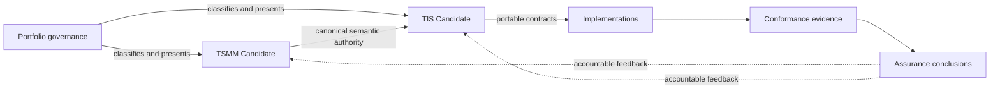

# TSMM and TIS Candidate alignment

The July 2026 coordinated update establishes member-owned Candidate status contracts for TSMM and TIS and reconciles the portfolio registry with those declarations.

The portfolio repository owns portfolio disposition, tier, cross-repository presentation, and review scheduling. TSMM and TIS retain their own maturity, lifecycle, operational, specification, and normative-scope declarations.
