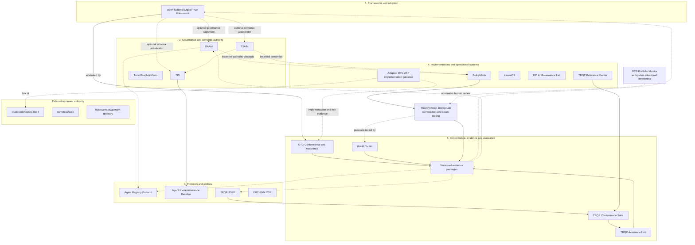

# Portfolio Architecture

## Purpose

This document defines the portfolio as a five-plane governance, adoption, implementation, and assurance system with cross-cutting policy execution, interoperability, and ecosystem-observation capabilities. It does not assert that all repositories share one normative authority, release process, dependency chain, or maturity level.

## Planes

1. **Frameworks and adoption** composes jurisdiction, sector, policy, architecture, profile, implementation, assurance, and redress choices without mandating a single technical stack.
2. **Governance and semantic authority** defines authority, semantics, contracts, patterns, and failure models.
3. **Protocols and profiles** translate general concepts into domain-specific normative and implementation requirements.
4. **Implementations and operational systems** exercise protocols, profiles, policies, and controls in software or applied environments.
5. **Conformance, evidence, and assurance** tests implementations and requirements, pressure-tests risks and harms, retains provenance, and produces reviewable conclusions.

Upstream-derived work is represented as a provenance boundary across the relevant planes. An adapted fork may be strategically included while upstream governance and release authority remain external.

## Cross-cutting capabilities

Three cross-cutting capabilities are deliberately not modelled as new planes:

- **PolicyMesh** evaluates whether a proposed action is permitted under presented policy, mandate, evidence, and time context. It does not establish the legitimacy of external authority or redefine GAAM/TSMM semantics.
- **Trust Protocol Interop Lab** owns experimental compositions, invariants, negative tests, and interoperability evidence. It tests whether independently governed components compose without losing authority, delegation, lifecycle, provenance, or accountability semantics; it does not acquire protocol governance authority.
- **DTG Portfolio Monitor** observes wider ecosystem activity, convergence, and alignment. Its signals can nominate questions for human review, but cannot admit interoperability cases, change portfolio classifications, or create assurance claims.



## Relationship semantics

| Edge | Meaning |
|---|---|
| Solid | Operational production, implementation, testing, evaluation, or evidence flow |
| Dashed | Informative alignment, optional acceleration, observation, feedback, provenance, or contribution-oriented learning |
| Plane boundary | Distinct architectural function and authority context |
| External upstream boundary | Upstream governance, normative, release, and adoption authority remains outside the portfolio |

The canonical typed relationships are maintained in [`../data/portfolio-relationships.yaml`](../data/portfolio-relationships.yaml).

## Observation, experimentation, and assurance boundaries

The portfolio intentionally separates three kinds of evidence-producing work:

1. The **Portfolio Assurance Monitor in this repository** checks whether curated portfolio claims remain supported by evidence.
2. The **DTG Portfolio Monitor** observes change across the wider DTG ecosystem and derives deterministic situational-awareness signals.
3. The **Trust Protocol Interop Lab** executes bounded interoperability experiments and retains composition evidence.

These are not interchangeable. Observation may nominate a question; experimentation may produce evidence about a composition; assurance may evaluate claims against requirements. Human governance remains the authority for portfolio classification and upstream engagement.

## Assurance model

Conformance asks whether an implementation satisfies declared requirements. Security hardening asks whether an adversary can violate intended properties. RAHP asks what risks and harms remain, to whom, and whether prevention, detection, evidence, guardrails, and redress are testable. These lenses may share evidence but do not collapse into one another.

```text
Conformance -> specification/implementation evidence
Security    -> adversarial findings and closure tests
RAHP        -> risk/harm/control/guardrail/assurance-test traceability
                    \
                     -> evidence-backed assurance conclusions
```

## Adapted upstream work

`adapted-upstream-work` identifies a fork whose local artefacts have become a substantive portfolio capability. It records fork-local implementation, risk, deployment, assurance, documentation, or learning value without claiming upstream authorship, governance, release authority, endorsement, or adoption.

The DTG ZKP Task Force fork uses this disposition for fork-local implementation, threat, risk, deployment, and assurance guidance. The former `dtgwg-rahp-tf` fork is retained only as historical/superseded lineage. The standalone `rahp-toolkit` is original portfolio work and owns its portable pressure-testing workflows, security-hardening reviews, evidence tooling, and adoption guidance while preserving DTG provenance as attribution rather than authority.

## Assurance feedback

Assurance is not a terminal publication step. Evidence-backed findings return to the relevant framework, authority, profile, schema, protocol, implementation, or adapted fork as controlled change inputs. A finding does not automatically modify normative content. Correction requires the owning repository or upstream project's governance process.

## Authority model

- The profile repository owns portfolio classification, tier, presentation, and relationship metadata.
- Original repositories own their normative scope, releases, status declarations, validation, and evidence.
- PolicyMesh owns only its artefact formats, policy-execution semantics, and federation behaviour; legitimacy of external authority remains external.
- The Interop Lab owns only experimental compositions, evidence, findings, and maturity claims.
- The DTG Portfolio Monitor owns collected/derived observation evidence and deterministic situational-awareness signals, not upstream state or governance.
- Adapted forks own only fork-local additions and their evidence; upstream projects retain upstream governance, releases, and adoption decisions.
- Conflicts are recorded as findings. The profile may reduce prominence or mark evidence insufficient, but it must not silently rewrite a member or upstream declaration.
