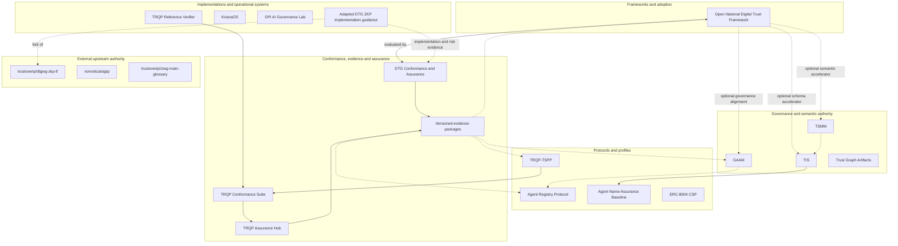

# Portfolio Architecture

## Purpose

This document defines the portfolio as a five-plane governance, adoption, implementation, and assurance system. It does not assert that all repositories share one normative authority, release process, dependency chain, or maturity level.

## Planes

1. **Frameworks and adoption** composes jurisdiction, sector, policy, architecture, profile, implementation, assurance, and redress choices without mandating a single technical stack.
2. **Governance and semantic authority** defines authority, semantics, contracts, patterns, and failure models.
3. **Protocols and profiles** translate general concepts into domain-specific normative and implementation requirements.
4. **Implementations and operational systems** exercise protocols, profiles, and controls in software or applied environments.
5. **Conformance, evidence, and assurance** tests implementations and requirements, retains provenance, and produces reviewable conclusions.

Upstream-derived work is represented as a provenance boundary across the relevant planes. An adapted fork may be strategically included while upstream governance and release authority remain external.

## Relationship semantics

| Edge | Meaning |
|---|---|
| Solid | Operational production, implementation, testing, evaluation, or evidence flow |
| Dashed | Informative alignment, optional acceleration, feedback, provenance, or contribution-oriented learning |
| Plane boundary | Distinct architectural function and authority context |
| External upstream boundary | Upstream governance, normative, release, and adoption authority remains outside the portfolio |

The canonical typed relationships are maintained in [`../data/portfolio-relationships.yaml`](../data/portfolio-relationships.yaml).

## Adapted upstream work

`adapted-upstream-work` identifies a fork whose local artefacts have become a substantive portfolio capability. It records fork-local implementation, risk, deployment, assurance, documentation, or learning value without claiming upstream authorship, governance, release authority, endorsement, or adoption.

The DTG ZKP Task Force fork uses this disposition because its local implementation guide, threat and risk treatment, deployment guidance, and assurance-oriented documentation are portfolio-relevant adaptations. Its canonical upstream remains `trustoverip/dtgwg-zkp-tf`.

## Assurance feedback

Assurance is not a terminal publication step. Evidence-backed findings return to the relevant framework, authority, profile, schema, protocol, implementation, or adapted fork as controlled change inputs. A finding does not automatically modify normative content. Correction requires the owning repository or upstream project's governance process.

## Authority model

- The profile repository owns portfolio classification, tier, presentation, and relationship metadata.
- Original repositories own their normative scope, releases, status declarations, validation, and evidence.
- Adapted forks own only fork-local additions and their evidence; upstream projects retain upstream governance, releases, and adoption decisions.
- Conflicts are recorded as findings. The profile may reduce prominence or mark evidence insufficient, but it must not silently rewrite a member or upstream declaration.
