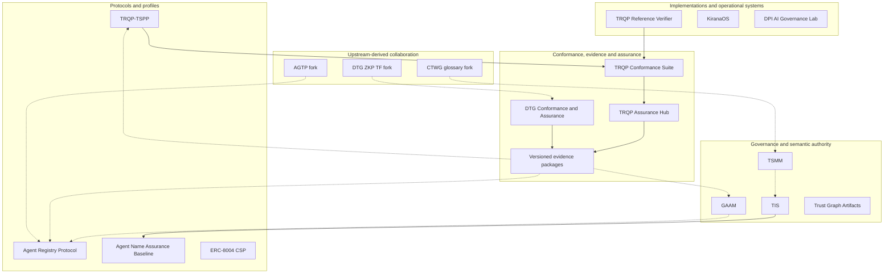

# Portfolio Architecture

## Purpose

This document defines the portfolio as a four-plane governance and assurance system. It is not a claim that all repositories share one normative authority, release process, or maturity level.

## Planes

1. **Governance and semantic authority** defines authority, semantics, contracts, patterns, and failure models.
2. **Protocols and profiles** translates general concepts into domain-specific normative and implementation requirements.
3. **Implementations and operational systems** exercise protocols, profiles, and controls in software or applied environments.
4. **Conformance, evidence, and assurance** tests implementations and requirements, retains provenance, and produces reviewable conclusions.
5. **Upstream-derived collaboration** is a separately bounded contribution surface whose upstream projects retain governance and release authority.

## Relationship semantics

| Edge | Meaning |
|---|---|
| Solid | Operational production, implementation, testing, or evidence flow |
| Dashed | Informative alignment, feedback, or contribution-oriented learning |
| Plane boundary | Distinct architectural function and authority context |
| Upstream plane | Fork-local work without upstream governance or release authority |

The canonical typed relationships are maintained in [`../data/portfolio-relationships.yaml`](../data/portfolio-relationships.yaml).

## Assurance feedback

Assurance is not a terminal publication step. Evidence-backed findings return to the relevant authority, profile, schema, protocol, or implementation as controlled change inputs. A finding does not automatically modify normative content. Correction requires the owning repository’s governance process.

## Authority model

- The profile repository owns portfolio classification, tier, presentation, and relationship metadata.
- Original repositories own their normative scope, releases, status declarations, validation, and evidence.
- Upstream projects own upstream governance, releases, and adoption decisions.
- Conflicts are recorded as findings. The profile may reduce prominence or mark evidence insufficient, but it must not silently rewrite a member declaration.
